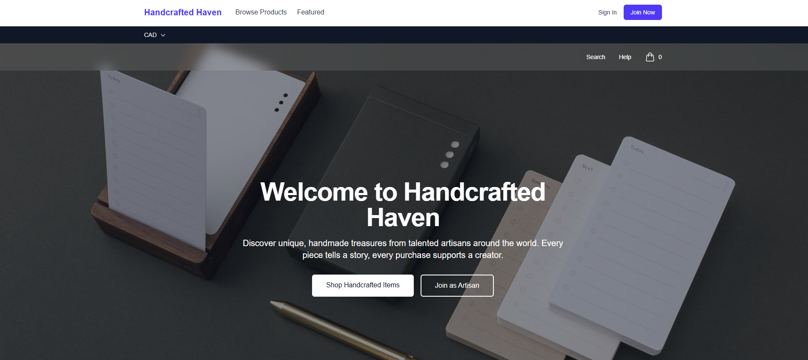

# Handcrafted Haven

Handcrafted Haven is a web application that serves as a platform for artisans and crafters to showcase and sell their handcrafted items. It connects creators with customers, promoting unique, handmade products.



## Group Members

- IFEANYI IFEGWU IBIAM
- Onesmus Dzidzai Maenzanise
- Figuelia Ya'Sin
- Abimael Silva Tavares

## Technologies Used

- Front-End: Next.js, React, TypeScript, Tailwind CSS
- Back-End: Next.js API Routes, Node.js
- Database: MongoDB with Mongoose
- Authentication: JWT with HTTP-only cookies
- Deployment: Vercel
- Project Management: GitHub Projects

## Features

### Implemented User Stories

1. **As a seller, I want to create a profile so that buyers can learn about my craft**
   - Seller profile creation and editing
   - Business information, craft specialties, and social media links
   - Years of experience and business description

2. **As a user, I want to filter items by category so I can find relevant products**
   - Product category system with hierarchical structure
   - Category-based filtering and navigation
   - Search functionality across products

3. **As a buyer, I want to leave a rating and review**
   - Review submission with 1-5 star ratings
   - Review display with rating distribution
   - Review sorting and pagination

### Additional Features

- User authentication (buyer/seller roles)
- Product listing and management
- Responsive design
- Accessible and SEO-friendly

## Setup Instructions

### Prerequisites

- Node.js (v18 or higher)
- MongoDB (local installation or MongoDB Atlas)
- npm or yarn

### Installation

1. Clone the repository:
   ```bash
   git clone git@github.com:IFY1237IBIAM/wdd430-group_project.git
   cd wdd430-group_project
   ```

2. Install dependencies:
   ```bash
   npm install
   ```

3. Set up environment variables:
   Create a `.env.local` file in the root directory with the following variables:
   ```
   MONGODB_URI=mongodb://localhost:27017/handcrafted_haven
   NEXTAUTH_URL=http://localhost:3000
   NEXTAUTH_SECRET=your-secret-key-here
   JWT_SECRET=your-jwt-secret-here
   ```

4. Seed the database with initial categories:
   ```bash
   npm run seed:categories
   ```

5. Start the development server:
   ```bash
   npm run dev
   ```

6. Open [http://localhost:3000](http://localhost:3000) in your browser.

## Usage

### For Buyers

1. Register as a buyer or sign in
2. Browse products by category or search
3. View product details and seller profiles
4. Leave reviews and ratings for products

### For Sellers

1. Register as a seller
2. Complete your seller profile with business information
3. Add products with descriptions, images, and pricing
4. Manage your product listings

## API Endpoints

### Authentication
- `POST /api/auth/register` - User registration
- `POST /api/auth/login` - User login
- `POST /api/auth/logout` - User logout
- `GET /api/auth/me` - Get current user

### Seller Profiles
- `GET /api/seller/profile` - Get seller profile
- `PUT /api/seller/profile` - Update seller profile
- `GET /api/sellers/[id]` - Get public seller profile

### Products
- `GET /api/products` - Get products with filtering
- `POST /api/products` - Create product (sellers only)

### Categories
- `GET /api/categories` - Get all categories
- `POST /api/categories` - Create category

### Reviews
- `GET /api/products/[id]/reviews` - Get product reviews
- `POST /api/products/[id]/reviews` - Create review

## Database Models

- **User**: User accounts with buyer/seller roles and seller profile information
- **Product**: Product listings with pricing, images, and inventory
- **Category**: Product categories with hierarchical structure
- **Review**: Product reviews with ratings and comments

## Contributing

1. Fork the repository
2. Create a feature branch
3. Make your changes
4. Test thoroughly
5. Submit a pull request
